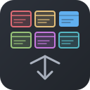

# Switch It Easy

Colorful window-code icons in your editor title bar — click to instantly switch between open VS Code windows.

## Features

- Up to **10 open windows** shown as color-coded icons in the editor title bar
- **One click** to switch — no menus, no shortcuts to memorize
- **Current window** is highlighted with a solid filled icon
- **Alphabetically sorted** by workspace name for consistency
- **Fast switching** via a precompiled native Swift binary (~150ms)
- Works with **VS Code, Cursor**, and other Electron-based editors

## How it works

Each open window gets a unique colored icon (One Dark palette). The current window stands out with a bold solid fill, while other windows appear as subtle outlines. Just click the icon to switch.

## Requirements

- **macOS only** — uses macOS Accessibility API for window discovery and switching
- **Accessibility permission** must be granted to VS Code / Cursor in System Settings > Privacy & Security > Accessibility

## Commands

| Command | Description |
|---------|-------------|
| `Switch It Easy: Refresh Windows` | Manually refresh the window list |

Windows are also auto-refreshed every 5 seconds and on window focus.

## Known limitations

- macOS only (uses native Accessibility API)
- Maximum 10 windows displayed
- Requires Accessibility permission

## License

[MIT](LICENSE)
